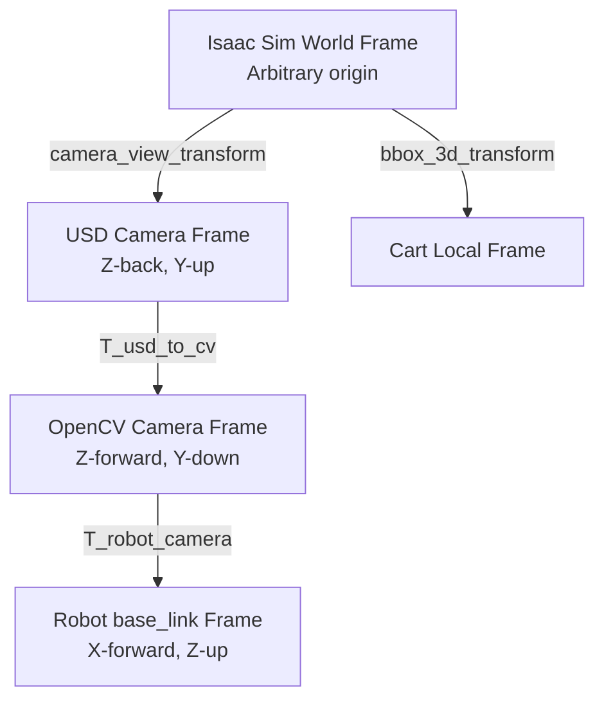

# Coordinate Frame Transformations

This document outlines the coordinate frame transformations required to align Isaac Sim synthetic ground truth data with point clouds reconstructed from camera images in the `6DPose` project.

---

## 1. Executive Summary

During initial testing, the ground truth CAD model (rendered in blue) was significantly offset from the actual point cloud (reconstructed from depth data) and the predicted mesh (rendered in green). 

The root cause was identified as a coordinate frame mismatch:
1. The dataset's raw ground truth object pose (`bbox_3d_transform`) is defined in an arbitrary **Isaac Sim World Frame**.
2. The camera is moving and resides in the same arbitrary world frame.
3. The coordinate axes convention of the camera in **USD/Isaac Sim** differs from the standard **OpenCV/Open3D** convention.

By establishing a rigorous transform chain and converting the coordinate conventions from USD to OpenCV, the ground truth pose is successfully aligned with the reconstructed point cloud in the robot base frame (`base_link`), shifting the translation from an offset space to a physically correct location (resting on the floor in front of the robot).

---

## 2. Coordinate Frame Definitions

The pipeline operates across four coordinate systems:

### Reference Frames and Axes Layouts

| Frame | $+X$ Axis | $+Y$ Axis | $+Z$ Axis | Description |
| :--- | :--- | :--- | :--- | :--- |
| **Isaac Sim World** | Right | Forward | Up | Global scene coordinate system. |
| **USD Camera** | Right | Up | Backward | Standard USD camera local frame (looks along $-Z$). |
| **OpenCV / Open3D** | Right | Down | Forward | Optical camera convention (looks along $+Z$). |
| **Robot Base (`base_link`)** | Forward | Left | Up | Physical base coordinate system of the robot. |

### Convention Mismatch: USD vs. OpenCV Camera
The transformation from the USD camera frame to the OpenCV/Open3D camera frame requires reversing the Y and Z axes:
- $X_{\text{cv}} = X_{\text{usd}}$
- $Y_{\text{cv}} = -Y_{\text{usd}}$
- $Z_{\text{cv}} = -Z_{\text{usd}}$

This is implemented using a diagonal coordinate-change matrix:
$$T_{usd\_to\_cv} = \begin{bmatrix} 1 & 0 & 0 & 0 \\ 0 & -1 & 0 & 0 \\ 0 & 0 & -1 & 0 \\ 0 & 0 & 0 & 1 \end{bmatrix}$$

---

## 3. Mathematical Formulation of the Transform Chain

To transform the cart's ground truth pose from the world frame to the robot base frame, the following sequence of transformations is performed:

### Step 1: Map the Cart Pose to the USD Camera Frame
We project the cart's pose ($T_{world\_to\_cart}$) relative to the camera ($T_{world\_to\_camera}$):
$$T_{camera\_cart\_usd} = T_{world\_to\_camera} \times T_{world\_to\_cart}$$

*Note: In the dataset, `camera_view_transform` represents $T_{world\_to\_camera}$ and is stored in column-major format. In Python, this is reshaped to 4x4 and transposed (`.T`) to obtain a standard row-major homogeneous transform.*

### Step 2: Convert to the OpenCV Camera Frame
We apply the coordinate change matrix to match Open3D's camera conventions:
$$T_{camera\_cart\_cv} = T_{usd\_to\_cv} \times T_{camera\_cart\_usd}$$

### Step 3: Project to the Robot Base Frame
Finally, we apply the camera-to-robot base transformation matrix ($T_{robot\_camera}$):
$$T_{gt\_robot} = T_{robot\_camera} \times T_{camera\_cart\_cv}$$

Combining all steps, the complete transformation chain is:
$$T_{gt\_robot} = T_{robot\_camera} \times T_{usd\_to\_cv} \times T_{world\_to\_camera} \times T_{world\_to\_cart}$$

---

## 4. Verification and Diagnostic Results

A diagnostic evaluation was performed on the first sample image of the dataset to compare the physical point cloud center (in OpenCV camera space) against different transformation configurations:

* **Reconstructed Point Cloud Center**: `[2.2586, -0.98523, 2.5273]` (meters)
* **Direct Calculation without USD correction**: `[1.6379, 0.0, -2.2489]` (negative Z, placing it behind the camera)
* **Corrected OpenCV Camera Pose ($T_{camera\_cart\_cv}$)**: `[1.6379, 0.0, 2.2489]` (correct positive Z and translation offsets)
* **Resulting Ground Truth Pose in Robot Frame ($T_{gt\_robot}$)**: `[3.2056, 0.0, 0.0100]`

### Interpretation
- **Z-Coordinate ($0.010\text{m}$)**: Confirms the cart rests correctly on the floor plane ($Z \approx 0$).
- **X-Coordinate ($3.205\text{m}$)**: Places the cart directly in front of the robot.
- **Y-Coordinate ($0.0\text{m}$)**: Confirms the cart is centered along the robot's forward axis.

This matches the physical scenario, allowing the ground truth CAD model to align perfectly with the point cloud.
