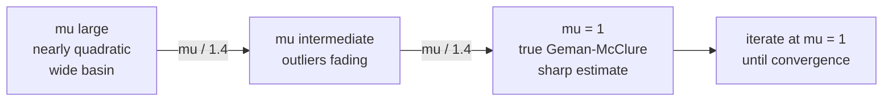

# Graduated Non-Convexity in the SE(2) ICP Refinement

This document derives the robust local refinement used by the 3 DoF pipeline
(`methods/se2_icp.py`), the sensor noise model it is scaled by
(`methods/depth_noise.py`), and the two diagnostics it reports. It is the
long-form companion to those modules, whose docstrings deliberately stay short.

Reference: Yang, Antonante, Tzoumas, Carlone, *Graduated Non-Convexity for Robust
Spatial Perception*, RA-L 2020 ([arXiv:1909.08605](https://arxiv.org/abs/1909.08605)).

---

## 1. The Problem: One Parameter, Two Jobs

The local refinement minimises a point-to-plane cost over $T \in SE(2)$:

$$\min_{T} \sum_i \left[\, \mathbf{n}_i \cdot (T \mathbf{p}_i - \mathbf{q}_i) \,\right]^2$$

where $\mathbf{p}_i$ is a model point, $\mathbf{q}_i$ its nearest scene point and
$\mathbf{n}_i$ that scene point's surface normal. The residual

$$r_i = \mathbf{n}_i \cdot (T \mathbf{p}_i - \mathbf{q}_i)$$

is the signed distance from the transformed model point to the tangent plane at
its match.

Which pairs $(\mathbf{p}_i, \mathbf{q}_i)$ enter that sum was governed by a
single parameter, `icp_max_correspondence_distance`, the KD-tree query radius.
That one number was doing two incompatible jobs.

| | Job A — outlier rejection | Job B — capture basin |
| :--- | :--- | :--- |
| **Question it answers** | Is this residual noise-plausible? | Can this model point find a match at all? |
| **Wants to be** | **Tight** — a loose threshold pairs model points with the wrong scene points and settles into a biased minimum | **Generous** — a pose the global stage left 3 cm out must still retrieve neighbours or it cannot converge |
| **Set by** | Sensor noise | The global stage's residual pose error |

One number cannot serve both. This is visible in the tuning history: 60-trial
Optuna sweeps pinned the parameter against the lower bound of its declared range
and still left a ~2.4 cm translation plateau. The metric wanted Job A; the
failures wanted Job B.

The concrete failure mode was the *far sheet*. The cart meshes are
zero-thickness shells, so a uniformly sampled model cloud contains both the
near surface of every tube and its far surface, and only the near one is
observable. Left in, the far-sheet points still demand a correspondence and drag
the fit toward the sensor — a ~2.2 cm bias measured by initialising ICP *at* the
ground truth and watching it walk away.

**The fix splits the jobs.** The radius keeps Job B only and is now purely the
KD-tree query radius. Job A moves to a robust kernel whose non-convexity is
annealed in — graduated non-convexity.

---

## 2. Graduated Non-Convexity

### 2.1 Black–Rangarajan Duality

A robust cost $\rho(\cdot)$ replaces the squared residual, so the objective
becomes $\sum_i \rho(r_i)$. Directly minimising a non-convex $\rho$ from a
mediocre initialisation lands in whatever local minimum is nearest — for a
near-symmetric object, often the symmetry twin.

Black–Rangarajan duality (Lemma 1 of the paper) rewrites this as a joint
minimisation over the pose and a set of per-measurement weights
$w_i \in [0,1]$:

$$\min_{T,\, w_i \in [0,1]} \sum_i \left[\, w_i\, r_i^2 + \Phi_\rho(w_i) \,\right]$$

The inner problem in $T$ at fixed $w$ is an ordinary *weighted* least squares —
which is exactly what a Gauss-Newton step solves. The penalty $\Phi_\rho$ is what
stops the trivial solution $w_i = 0$.

### 2.2 The Geman-McClure Surrogate

The paper's Example 1 gives the Geman-McClure cost and its GNC surrogate,
governed by a control parameter $\mu$:

$$\rho(r) = \frac{\bar c^2 r^2}{\bar c^2 + r^2} \qquad \Longrightarrow \qquad \rho_\mu(r) = \frac{\mu \bar c^2 r^2}{\mu \bar c^2 + r^2}$$

with $\bar c$ the scale at which a residual stops being noise-plausible. The
surrogate has the two properties GNC needs:

- as $\mu \to \infty$, $\rho_\mu$ becomes quadratic, hence **convex** — one broad
  basin, no local minima;
- at $\mu = 1$, $\rho_\mu = \rho$, the true robust cost.

Proposition 3 of the paper gives the closed-form weight update:

$$w_i = \left( \frac{\mu \bar c^2}{r_i^2 + \mu \bar c^2} \right)^{2}$$

Writing $s^2 = \mu \bar c^2$ makes the shape readable: $w(0) = 1$, $w(s) = 1/4$,
$w(3s) = 1/100$. So $s$ is an effective noise scale, not a cut-off, and nothing
is ever discarded discontinuously.

### 2.3 The Anneal

GNC minimises the true cost by minimising a *sequence* of surrogates, starting
convex and sharpening. Remark 5 of the paper: start at
$\mu_0 = 2 r_{\max}^2 / \bar c^2$, update $\mu \leftarrow \mu / 1.4$ each outer
iteration, stop when $\mu < 1$. Each outer iteration performs a single variable
update and a single weight update.

That ordering is the entire mechanism. The iterate is walked into the right
basin while the cost is still nearly convex; the non-convexity is reintroduced
only once it is already there.

### 2.4 Why We Anneal $\mu$ and Not an Absolute Scale

An earlier version of this module annealed $s$ directly, in meters, from the
KD-tree radius down to a configured `scale_min`, using $\sqrt{1.4} = 1.1832$ as
the per-step divisor. That is algebraically the same schedule — since
$s = \sqrt{\mu}\,\bar c$, dividing $\mu$ by 1.4 divides $s$ by $\sqrt{1.4}$ — but
it could not survive $\bar c$ becoming per-correspondence (§3): with a different
$\bar c$ per point there is no single scale in meters to anneal.

Annealing $\mu$, as the paper does, fixes that and pays for itself three times:

1. **`scale_min` stops being configuration.** The anneal terminates at $\mu = 1$,
   where the scale *is* $\bar c_i$ — physics, not a hyperparameter.
2. **The shrink constant becomes the paper's literal 1.4.** The square root only
   ever existed to convert a step in $\mu$ into a step in $s$.
3. **The summary-statistic question disappears.** There is no median-versus-mean
   decision to defend, because nothing is summarised.

### 2.5 Fitting the Iteration Budget

Writing $k$ for the shrink factor, the sequence $\mu_j = \mu_0 / k^j$ first
reaches 1 at

$$J = \left\lceil \frac{\ln \mu_0}{\ln k} \right\rceil$$

so the anneal wants $N = J + 1$ entries. Note that the residuals do not appear:
once $\mu_0$ is fixed the length is known before the next correspondence is
computed, so annealing cannot run away on a hard frame.

If $N >$ the iteration budget, the anneal cannot finish. **Stopping short is the
wrong response** — it leaves the kernel wide, meaning no outlier rejection at
all, while still returning a pose. The silent failure is worse than the loud
one. So the shrink factor is clamped *up* to the smallest value that fits:

$$k_{\text{eff}} = \max\left(k,\; \mu_0^{\,1/(\text{budget}-1)}\right)$$

and the clamp is logged at WARNING, because the correct response is to fix the
configuration rather than rely on it.

---

## 3. The Depth Noise Model

$\bar c$ is "the maximum error expected for the inliers". For a stereo camera
that is not a constant — it grows as the **square of the range**.

### 3.1 Derivation

A stereo pair recovers depth from disparity $d$ (pixels) by

$$z = \frac{f B}{d}$$

with $f$ the focal length in pixels and $B$ the baseline in meters. The matcher
does not measure $d$ exactly; it has a sub-pixel accuracy $\sigma_d$.
Differentiating and substituting $d = fB/z$ to eliminate $d$:

$$\frac{dz}{dd} = -\frac{fB}{d^2} = -\frac{fB}{(fB/z)^2} = -\frac{z^2}{fB}$$

so a disparity error $\sigma_d$ appears as a depth error

$$\boxed{\;\sigma_z = \frac{z^2 \sigma_d}{f B}\;}$$

On this rig $fB = 639.99768 \text{ px} \times 0.095 \text{ m} = 60.80 \text{ px·m}$,
and at $\sigma_d = 0.1$ px:

| $z$ | $\sigma_z$ |
| :--- | :--- |
| 1.5 m | 0.0037 m |
| 2.0 m | 0.0066 m |
| 3.0 m | 0.0148 m |
| 4.5 m | 0.0333 m |

### 3.2 It Must Be the Optical-Axis Depth

The $z$ in that formula is the coordinate **along the camera's optical axis**,
because that is the only thing the disparity relation gives. It is *not* the
Euclidean range $\lVert \mathbf{p} - \mathbf{c} \rVert$, which is $z/\cos\theta$
for a point $\theta$ off-axis. A cart spanning 20–30° of field would overstate
$z$ by 6–15%, and squaring makes that 12–30% on the noise bound.

`DepthSensor.depth` therefore applies the inverse extrinsic and takes the third
component. Only the third row is needed, so it is a matrix-vector product per
point.

### 3.3 Why the Bound Is Per-Point

A single constant `scale_min = 0.0148` used to stand in for the whole formula,
fixed at $z = 3.0$ m. That is wrong **between** frames — a cart at 4.5 m gets a
kernel 2.25× tighter than its own sensor noise, so every honest inlier on that
frame is treated as a partial outlier.

It is also wrong **within** a frame, and that is what makes a per-frame scalar
the wrong *shape* of fix rather than merely an imprecise one. Measured on the
six local fixtures, the camera-frame depth spread of a single scene cloud:

| frame | $z_{p05}$ | $z_{p95}$ | ratio | implied $\sigma_z$ spread |
| :--- | :--- | :--- | :--- | :--- |
| picanol | 1.11 m | 4.22 m | 3.8× | **14×** |
| picanol | 2.31 m | 5.15 m | 2.2× | 5.0× |
| leanflow | 1.58 m | 4.04 m | 2.6× | 6.6× |
| colruyt | 1.27 m | 4.11 m | 3.2× | 10× |

Any summary statistic — median, mean, max — discards a spread of 5–14× and
re-creates inside each frame exactly the error it was introduced to fix between
them.

> **Note on those numbers.** A towing cart is not 3 m deep. A p05→p95 span of
> ~3 m says the YOLO mask is admitting background or floor. That is a separate
> finding worth chasing, and it bounds how literally the table above should be
> read. It does not weaken the argument: the kernel is scaled by $\bar c$ at the
> *matched* scene points, and the matched set is anchored to the model, so the
> leakage inflates the reported spread more than it inflates the effect.

### 3.4 What the Bound Is Not

$\sigma_z$ is uncertainty along the optical axis, whereas the residual it gates
is measured along the **surface normal**. The two coincide only for a surface
facing the camera squarely; in general the along-normal component is
$\sigma_z \lvert \mathbf{n} \cdot \hat{\mathbf{r}} \rvert$ with
$\hat{\mathbf{r}}$ the viewing ray, which is smaller.

So the shipped bound is a **loose upper bound** on the noise the residual
actually sees. That is the safe direction: a kernel slightly too wide keeps
honest inliers, whereas one too tight discards them. Tightening it to the
projected form would need a floor (as $\mathbf{n} \perp \hat{\mathbf{r}}$ the
bound goes to zero and the weights collapse), which means introducing a
CAD-versus-real model-error constant. Not done; recorded here as the next rung.

### 3.5 Initialising $\mu$

With $\bar c$ per-correspondence, the paper's $\mu_0 = 2 r_{\max}^2 / \bar c^2$
generalises to the largest **normalised** residual:

$$\mu_0 = 2 \max_i \left( \frac{r_i}{\bar c_i} \right)^{2}$$

which is dimensionless, as $\mu$ must be. The factor 2 is the paper's: it places
the worst correspondence at $w = (2/3)^2 = 0.44$ on the first pass — broad enough
to be nearly quadratic, not so broad that iterations are wasted.

Deriving $\mu_0$ from the data makes the anneal **adaptive**: an easy frame gets
a short schedule, a hard one a long schedule. The previous code annealed from the
KD-tree radius every time, so on a well-initialised frame the first several steps
ran at scales above every residual present — plain unweighted ICP iterations
wearing an anneal's clothing.

It cannot run away, because both ends are bounded: $r_i \le$ radius by the
KD-tree query, and $\bar c_i \ge \sigma_z$ at the near range. At a 0.1377 m
radius and a 2 m near range, $\mu_0 \le 2 \times 20.9^2 = 872$, needing
$\lceil \ln 872 / \ln 1.4 \rceil + 1 = 21$ iterations against a budget of 100.

---

## 4. Conditioning: Levenberg-Marquardt Damping

Each iteration solves $3\times3$ normal equations $J^\top W J\, \xi = -J^\top W r$
for the increment $\xi = (\omega, v_x, v_y)$.

There is a geometry in this pipeline that makes that system rank-deficient:
**a single plane**. After the visibility cull, a cart seen head-on can leave a
model cloud dominated by its front face, where every normal is parallel. Sliding
along that face and rotating about it are both unobservable, so $J$ collapses
toward rank 1.

The danger is not that the solve fails — it is that it *succeeds*.
`np.linalg.solve` raises only on **exact** singularity; a merely ill-conditioned
system returns a large increment in an unconstrained direction, silently, and the
composition applies it.

The previous damping was an absolute `1e-12 * I`. On a normal matrix with
$O(1)$ entries that is below rounding, so it damped nothing. It is replaced by
damping scaled to the problem:

$$\lambda = \lambda_{\text{rel}} \cdot \frac{\operatorname{tr}(J^\top W J)}{3}, \qquad \lambda_{\text{rel}} = 10^{-6}$$

Adding $\lambda$ to every eigenvalue caps the damped condition number at roughly
$1/\lambda_{\text{rel}} = 10^6$ — far inside float64's $\sim 10^{16}$, so it never
perturbs a well-conditioned solve, while bounding the amplification along a
near-null direction.

Separately, the **undamped** condition number is logged at WARNING above $10^8$.
Measuring before damping is deliberate: the damping caps the damped number by
construction, so measuring after it would only report the cap back. This is a
diagnostic about the *scene*, not about numerics.

> Residual risk: LM bounds the amplification but not the step norm itself. If
> the warning fires on real data, a trust region is the next move.

---

## 5. What the Refinement Reports

Under GNC the old `fitness` stopped meaning anything. It counted model points
inside `icp_max_correspondence_distance` — but that radius is now the *capture
basin*, so the count measures basin **coverage** and saturates at 1.000 the
moment the radius is generous (as it did in `gnc_wide_frames.csv`).

`IcpResult` reports weighted summaries instead:

$$\text{effective\_inlier\_fraction} = \frac{\sum_i w_i}{N_{\text{model}}} \qquad\qquad \text{robust\_rmse} = \sqrt{\frac{\sum_i w_i r_i^2}{\sum_i w_i}}$$

both evaluated at the final pose with $\mu = 1$.

- $\sum_i w_i$ is an **effective count**, not a residual: a correspondence at
  $w = 1$ counted fully in the solve, one at $w = 0.5$ counted half. It is the
  soft version of the hard count. It reads **lower** than the old number —
  measured 0.35–0.72 against a hard fitness of ~0.68 — because points inside the
  radius now contribute $w < 1$. That is the old number having been inflated.
- `robust_rmse` is over the **point-to-plane** residual, the quantity actually
  minimised. The old `inlier_rmse` was a *Euclidean* nearest-neighbour distance
  and so could not be compared against the kernel scale at all — different
  metrics. The new one can, which turns "is my kernel tight relative to my
  residuals?" into a one-glance question.
- `median_kernel_scale` is reported alongside because without it neither number
  is interpretable: both are relative to a scale that now varies with range.

Scoring always happens at $\mu = 1$ regardless of where the loop stopped. $\mu$
is a homotopy parameter, not a property of the fit, so a run that exhausted its
budget mid-anneal must still be scored against the true cost for its numbers to
mean the same thing as a converged run's.

The global stages (`constrained_ransac`, `vsac_se2`) keep the hard-count
`RegistrationResult`, which is correct there: MSAC scoring is definitionally an
inlier count and its threshold is a real accept/reject boundary.

---

## 6. Deliberate Departures from the Paper

Two, recorded so neither is mistaken for an oversight.

**Re-association.** The paper assumes a *fixed* measurement set $y_i$; that is
what makes the Black–Rangarajan duality a majorisation and gives the outer loop
a descent guarantee. ICP re-runs the nearest-neighbour association every
iteration, so measurement $i$ is not the same measurement between iterations and
that guarantee does not carry over. This is what every robust ICP does (Zhou's
Fast Global Registration included) and is not changing — but the paper is
authority here for the *weighting* only, not for the loop around it.

**$\bar c$ = one sigma.** Remark 5 sets $\bar c$ to "the maximum error expected
for the inliers", and the reference it points to takes that as a chi-square
quantile, $\bar c = \sigma\sqrt{\chi^2_{1,0.99}} = 2.58\sigma$. We use one sigma,
so the kernel is ~2.6× tighter than the paper's convention: an inlier exactly one
sigma out keeps $w = 0.25$ rather than $0.76$.

This costs nothing at the residuals actually measured here — `robust_rmse` runs
0.0022–0.0058 m against kernel scales of 0.0034–0.0129 m, so the kernel sits near
$w \approx 0.8$ and is nearly flat — and it is partly offset by §3.4's bound
being loose in the opposite direction. Revisit if frames ever fail with a healthy
effective inlier fraction *and* residuals in the 1–3 cm band; that is the
signature of a kernel that discarded its own inliers.

---

## 7. Deriving the Capture Radius

With Job A handled by the kernel, the radius is answerable from first
principles. It must cover the pose error the global stage leaves, which displaces
a *model point* by both the translation error and the yaw error acting through a
lever arm:

$$r_{\text{capture}} = \lVert \Delta t \rVert_{p95} \;+\; L \, \lvert \Delta\theta \rvert_{p95} \;+\; k\,\sigma_z$$

- $\lVert \Delta t \rVert, \lvert \Delta\theta \rvert$ — VSAC's residual error at
  ICP entry, recorded per frame as `trans_xy_pre_icp` / `yaw_err_pre_icp`.
- $L$ — the model's radius of gyration, $\max \lVert \mathbf{p} - \bar{\mathbf{p}} \rVert$
  over the model cloud, ~0.5 m for these slabs. From the mesh, not a guess.
- $k = 3$ — the only free constant, and a familiar one.

On the six local fixtures: $\lVert \Delta t \rVert$ reaches 0.037 m,
$\lvert \Delta\theta \rvert$ reaches 7.0° = 0.122 rad, and $3\sigma_z \approx 0.04$ m
at the observed scales. That gives

$$r_{\text{capture}} \approx 0.037 + 0.5 \times 0.122 + 0.04 = 0.138 \ \text{m}$$

against the shipped, Optuna-tuned $0.1377$ m. The sweep found the physically
correct answer; the formula says *why*, which the 17-digit constant did not.

**This is six frames and must be confirmed on the full set before the constant is
replaced by the formula.** The supporting claim — that under GNC the error as a
function of the radius is a *step*, not a peak, so any radius above the knee is
equally good — is asserted by
`tests/test_gnc_icp.py::test_gnc_error_is_flat_across_the_radius`, which scans 25
radii and requires the spread above the knee to stay under 1 mm. If that plateau
holds on real data too, the radius should leave the Optuna search space
entirely: maximising an objective over a flat region returns a draw from
evaluation noise, which is what a 17-digit constant that nobody can re-derive
actually is.
